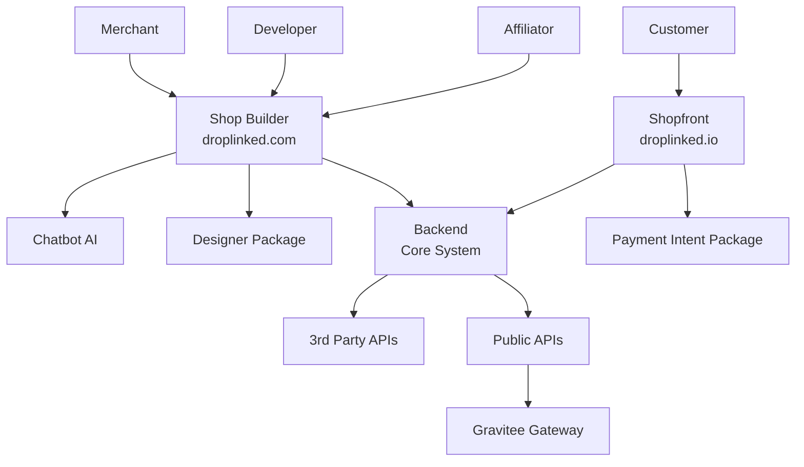

# System Architecture Flow

```mermaid
graph TD
    %% Users
    M[Merchant] --> SB[Shop Builder<br>droplinked.com]
    D[Developer] --> SB
    A[Affiliator] --> SB
    C[Customer] --> SF[Shopfront<br>droplinked.io]
    

    %% Core Systems
    SB --> CB[Chatbot AI]
    SB --> PD[Designer Package]
    SB --> BE[Backend<br>Core System]
    SF --> BE
    SF --> PI[Payment Intent Package]

    %% Integrations
    BE --> TP[3rd Party APIs]
    BE --> API[Public APIs]
    API --> GV[Gravitee Gateway]

```